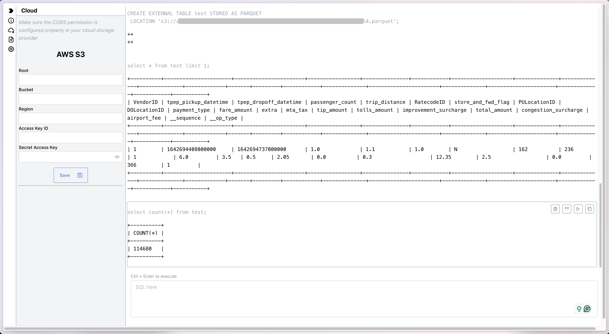

<div style="display: inline-flex; align-items: center; justify-content: center; margin: 0 auto;">
    
    
</div>

DataFusion Playground
---------------------

> [!NOTE]  
> The follow up development of this project is moved to [DataFusion WASM Playground](https://github.com/datafusion-contrib/datafusion-wasm-playground). Please check it out for the latest updates.

Playground of [Apache Arrow DataFusion](https://github.com/apache/arrow-datafusion) with [WebAssembly](https://webassembly.org). In the early experimental stage as my side project.

🌱 Live Demo: https://waynexia.github.io/datafusion-playground/

## Features

- Cloud storage support: HTTP, AWS S3 (Google Cloud Storage and Azure Blob Storage are on the way)
- Full functional DataFusion query engine.
- Data formats: CSV, Parquet, JSON, Avro

## Screenshot



## Examples

Create an external table from S3 parquet file:

```sql
CREATE EXTERNAL TABLE test STORED AS PARQUET
LOCATION 's3://path-to-your.parquet';
```

Explain a query:

```sql
EXPLAIN SELECT MIN(airport_fee), MAX(airport_fee) FROM test;
```
